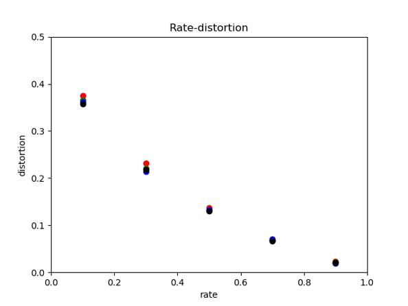
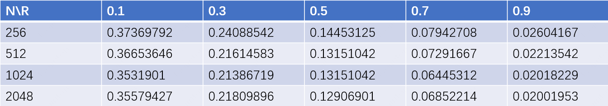

# Polarcode-Gradient-Compression

## Introduction
 Deep gradient compression using Polarcode, BytePS framework

## My work

- **A brief survey on distributed training algorithm:** Investigated the current gradient compression methods, and classified the methods in terms of gradient compression. 
The improvement direction of gradient compression is usually based on the following aspects: compression direction, 
distributed learning architecture, communication compression method, and error compensation. By analyzing the current 
main gradient compression methods, I determined the direction for improvement in gradient compression.
- **Polar Code as the optimal lossy compression algorithm:** I analyzed the possibility of Polar Code as a gradient compression method and the optimality of Polar Code as a lossy 
compression algorithm. Besides, the gradient compression algorithm for source compression was implemented using the 
Polar Code library of open source channel coding. Through experiments, the optimality of Polar Code as a lossy 
compression algorithm is verified. Finally, the possibility that Polar Code and other sparse gradient compression 
methods can be used together is analyzed.
- **Implementation:** I used BytePS framwork as a distributed training framework for comparing different gradient compression algorithms 
and introduced Polar Code gradient compression. Besides, BytePS is analyzed as a distributed training framework of 
Parameter Server architecture, and Polar Code as a gradient compression method is implemented on BytePS framwork.
- **More information:** My project [report](resources/Project_report.pdf) and [slides](resources/Project_report.pptx)

## Quick Start

### Install

- Follow the [installation guide](https://github.com/bytedance/byteps#quick-start) of BytePS, to install the 
distributed training framework. I recommend to use docker images to install the framework on multiple systems.
- However, most of my experiments can be done on a single machine environment, so running the following code can 
also reproduce most of my experiments.
```shell
git clone https://github.com/Kamu1403/Operating-System-Transplant.git
cd byteps
python3 setup.py install
```

- Then install the Polar Code library, my lossy compression algorithm is based on the Polar Code algorithm. You can 
follow this [installation guide](https://github.com/mcba1n/polar-codes#getting-started)

- Finally, install komm, a tensor bitstream converter. Here is the 
[installation guide](https://github.com/rwnobrega/komm#installation)

### Run the experiments

- The [implementation](polar_compression/Compressor.py) of Polar Code lossy compression.
```python
class PolarCompress:
    def __init__(self, N, K, SNR=5.0):
        # init

    def compress(self, message):
        # set message

    def decompress(self, message_received):
        # decompress the codeword
```

- And the bitstream version.
```python
class PolarCompressExtend:
    # set the compress rate here
    compress_rate = 0.5

    @staticmethod
    def compress(message: torch.Tensor):
        # set message

    @staticmethod
    def decompress(bit_message, ctx):
        # decompress the codeword
```

- In this [file](polar_compression/demo.py), I provide a demo.

Some result:





- Try it out with BytePS framework!
```shell
bash work_dir/try.sh
```

## Future plan
- In BytePS as a distributed framework for training, compare the Polar Code gradient compression method with other 
methods, and use Polar Code and other gradient compression methods together to conduct comparative experiments and 
improvements.

## References

- F. Seide, H. Fu, J. Droppo, G. Li, and D. Yu. 1-bit stochastic gradient descent and its application todata-parallel 
distributed training of speech dnns. InINTERSPEECH, 2014.
- Karimireddy S P, Rebjock Q, Stich S U, et al. Error Feedback Fixes SignSGD and other Gradient Compression 
Schemes[J]. arXiv preprint arXiv:1901.09847, 2019.
- Korada S B, Urbanke R L. Polar codes are optimal for lossy source coding[J]. IEEE Transactions on Information Theory, 
2010, 56(4): 1751-1768.
- https://github.com/bytedance/byteps
- https://github.com/mcba1n/polar-codes
- https://github.com/rwnobrega/komm